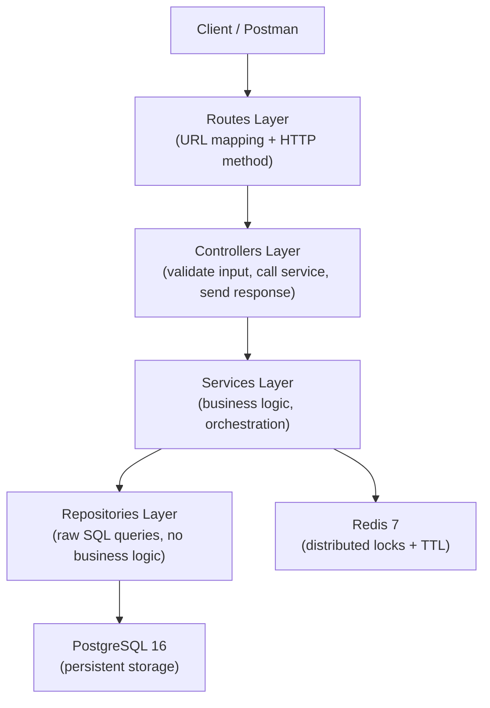
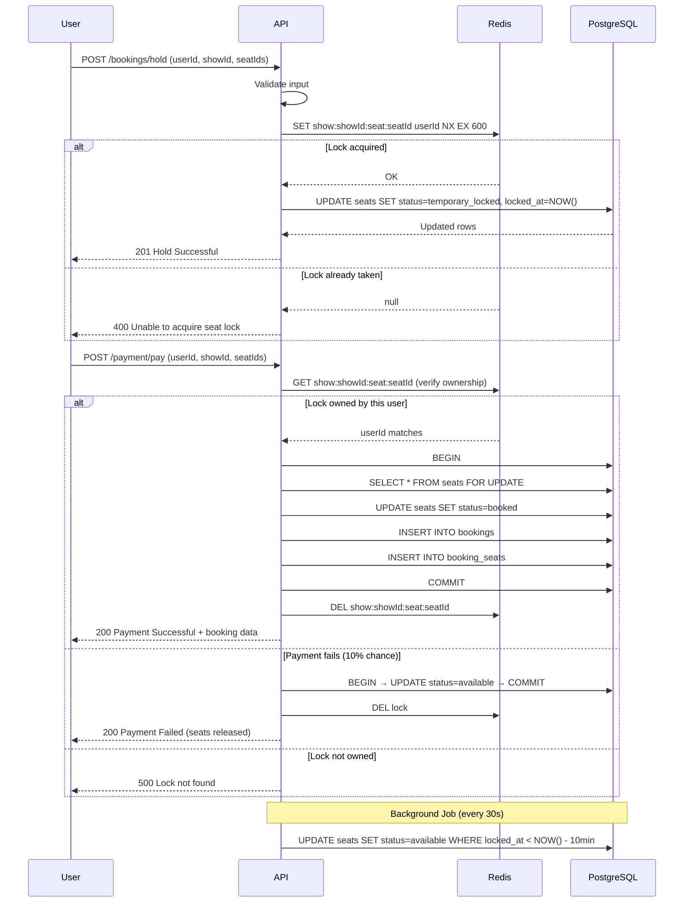
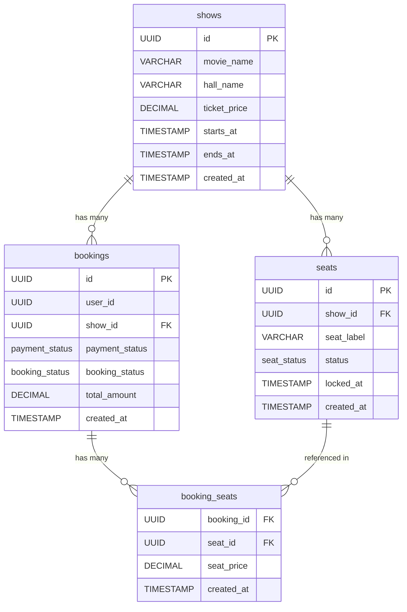

# SentinelTicket 


A high-throughput ticket booking REST API engineered to eliminate seat double-booking under massive concurrent traffic — without sacrificing performance.

Inspired by production systems like BookMyShow and Ticketmaster, SentinelTicket implements a **two-tier distributed locking architecture** using Redis and PostgreSQL to guarantee both speed and disk-level data consistency, even when thousands of users attempt to book the same seat simultaneously.

> **Pure backend project** — no frontend UI. All endpoints are tested via Postman or the included concurrency test scripts.

---

## The Problem This Solves

Imagine a popular concert sells out in seconds. 10,000 users click "Book Seat A1" at the same millisecond:

1. All 10,000 query the database → all see seat A1 as `available`
2. All 10,000 proceed to payment
3. All 10,000 write `status = booked` to the database
4. **Result: 10,000 confirmed bookings for one physical seat**

This is a **race condition** — a real, expensive bug that breaks production booking systems. SentinelTicket eliminates it at two independent layers so that even if one layer fails, the other catches it.

---

## Features

### Show Management
- Create shows with movie name, hall, ticket price, start/end times
- Auto-generate seat layout (configurable rows × seats per row) in a single atomic transaction
- List upcoming shows ordered by start time
- Get individual show details and real-time seat availability

### Distributed Locking (Tier 1 — Redis)
- Atomic seat hold using `SET NX EX` — only one user can hold a seat at a time
- 10-minute TTL — seats automatically expire if user abandons checkout
- Lock ownership verification before payment — prevents other users from confirming a lock they do not own
- Explicit lock release after successful booking or payment failure

### Concurrency Control (Tier 2 — PostgreSQL)
- `SELECT FOR UPDATE` row-level locking inside explicit `BEGIN / COMMIT / ROLLBACK` transactions
- Guarantees zero double-booking even if Redis fails or multiple users bypass Tier 1
- Status guard on all write operations (`AND status = 'available'`, `AND status = 'temporary_locked'`) prevents dirty writes

### Automatic Hold Expiry
- Background scheduler runs every 30 seconds
- Releases all seats where `locked_at < NOW() - INTERVAL '10 minutes'`
- No manual cleanup required — expired holds revert to `available` automatically
- `locked_at` timestamp tracked in the seats table for precise expiry calculation

### Payment Flow
- Simulated payment gateway (90% success rate) with 2-second processing delay
- On success: seats booked, booking record created, Redis lock released
- On failure: seats reverted to `available`, Redis lock released, user can retry

### Containerization
- Single `docker-compose up --build` command starts all three services
- Node.js app, PostgreSQL 16, and Redis 7 run in isolated Docker networks
- PostgreSQL data persists in a named Docker volume across restarts

### Database
- 6 ordered SQL migration files with a custom migration runner
- UUID primary keys (prevents enumeration attacks)
- Custom PostgreSQL ENUMs (`seat_status`, `payment_status`, `booking_status`)
- Composite index on `seats(show_id, status)` for fast availability queries
- Normalized `booking_seats` junction table for per-seat pricing and audit trails

### Concurrency Testing
- Two Axios-based stress test scripts simulating concurrent real-world traffic
- `concurrency-test.js` — 10,000 simultaneous hold requests for the same seat
- `concurrency-test-booking.js` — 1,000 simultaneous payment requests for the same seat

---

## Tech Stack

| Category | Technology | Version |
|---|---|---|
| **Language** | JavaScript (ES Modules) | ES2022+ |
| **Runtime** | Node.js | 22-alpine |
| **Framework** | Express | 5.x |
| **Primary Database** | PostgreSQL | 16-alpine |
| **Cache / Lock** | Redis (ioredis) | 7-alpine |
| **Containerization** | Docker + Docker Compose | 3.9 |
| **HTTP Client (tests)** | Axios | 1.x |
| **Dev Server** | Nodemon | 3.x |

---

## Architecture

SentinelTicket follows a strict **layered architecture** — every request travels through exactly four layers, each with a single responsibility.



### Layer Responsibilities

| Layer | Files | Responsibility |
|---|---|---|
| **Routes** | `*.routes.js` | Maps HTTP method + URL to a controller function |
| **Controllers** | `*.controller.js` | Validates request input, calls service, sends JSON response |
| **Services** | `*.service.js` | Orchestrates business logic, calls repositories and Redis |
| **Repositories** | `*.repository.js` | Executes parameterized SQL queries, returns raw rows |

---

## Booking Workflow



---

## Database Design



### Table Details

**`shows`** — Stores event and pricing information. All seat queries join back to this table for `ticket_price` during booking confirmation.

**`seats`** — Core concurrency table. The `status` ENUM (`available` → `temporary_locked` → `booked`) is the source of truth for seat state. The `locked_at` timestamp powers the background expiry job. A composite index on `(show_id, status)` ensures seat availability queries never do full table scans.

**`bookings`** — Immutable audit record created at payment confirmation. Both `payment_status` and `booking_status` use custom PostgreSQL ENUMs for type safety.

**`booking_seats`** — Junction table with a composite primary key `(booking_id, seat_id)`. Stores `seat_price` at booking time so historical records are unaffected by future price changes.

### PostgreSQL ENUMs

```sql
seat_status:     available | temporary_locked | booked
payment_status:  pending | completed | failed
booking_status:  confirmed | cancelled | expired
```

---

## Redis Locking — Deep Dive

### Why Redis for Tier 1?

Holding PostgreSQL row locks for a 10-minute checkout window would block every other transaction trying to touch those rows — catastrophic at scale. Redis holds the seat in memory with a TTL at near-zero latency, no disk I/O, no blocking, and automatically releases the lock if the user abandons checkout.

### The Atomic Lock Command

```js
SET show:<showId>:seat:<seatId>  <userId>  EX  600  NX
//                                          ^    ^    ^
//                                   value  |  TTL  only set if
//                               (user ID) |  10min  key doesn't
//                                         expires   exist yet
```

Redis processes commands sequentially in a single thread. When 10,000 users issue this command simultaneously, only one returns `"OK"` — the other 9,999 return `null` instantly, without touching PostgreSQL.

### Lock Ownership Verification

Before entering the PostgreSQL transaction, the system verifies the requesting user actually owns the lock:

```js
const lockedUserId = await redis.get(`show:${showId}:seat:${seatId}`);
if (userId !== lockedUserId) throw new Error("Lock not found");
```

This prevents User B from confirming a booking that User A holds.

### Lock Release

Locks are released in three scenarios:
1. **Successful booking** — explicit `DEL` after `COMMIT`
2. **Payment failure** — explicit `DEL` after seats reverted to `available`
3. **User abandonment** — automatic TTL expiry after 10 minutes (Redis) + background job cleanup in PostgreSQL

---

## PostgreSQL Concurrency — Deep Dive

### Why PostgreSQL for Tier 2?

Redis is fast but volatile. A Redis restart, network partition, or edge case where two requests slip through simultaneously requires a second, disk-level guarantee. PostgreSQL `SELECT FOR UPDATE` provides exactly this.

### The Row-Level Lock Transaction

```sql
BEGIN;

-- Acquire exclusive row lock — all other transactions trying to
-- touch these exact rows must WAIT until this transaction commits
SELECT * FROM seats
WHERE show_id = $1 AND id = ANY($2)
FOR UPDATE;

-- Verify seats are still in the expected state
-- (status guard prevents dirty writes)
UPDATE seats
SET status = 'booked', locked_at = NULL
WHERE show_id = $1
AND id = ANY($2)
AND status = 'temporary_locked';  -- guard condition

INSERT INTO bookings (...) VALUES (...) RETURNING *;
INSERT INTO booking_seats (...) VALUES (...);

COMMIT;
-- Row locks released automatically
```

### How Race Conditions Are Prevented

Even if Redis fails and 100 users reach the PostgreSQL transaction simultaneously:

1. User A acquires `FOR UPDATE` lock on seat rows — other 99 transactions **wait**
2. User A sets status to `booked` and commits
3. Users B–100 acquire the lock one by one, find `status = 'booked'`, fail the `AND status = 'temporary_locked'` guard
4. Their `updateSeatsToBooked` returns 0 rows → `bookingSeats.length !== seatIds.length` → exception → `ROLLBACK`

**Zero double-bookings. Guaranteed at the database level.**

---

## Automatic Hold Expiry

When a user holds seats but never completes payment, those seats need to return to `available`. SentinelTicket handles this at two levels:

**Level 1 — Redis TTL (immediate)**
The Redis lock key expires automatically after 600 seconds. No action required.

**Level 2 — PostgreSQL background job (database consistency)**
The `locked_at` column tracks when each seat was locked. A background scheduler in `app.js` runs every 30 seconds:

```js
setInterval(async () => {
    await releaseExpiredSeatHolds();
}, 30 * 1000);
```

The underlying SQL:
```sql
UPDATE seats
SET status = 'available'
WHERE status = 'temporary_locked'
AND locked_at < NOW() - INTERVAL '10 minutes'
RETURNING *;
```

This ensures PostgreSQL seat status stays consistent with Redis TTL expiry, even if the server restarts mid-session.

---

## API Reference

### Health

| Method | Endpoint | Description |
|---|---|---|
| `GET` | `/health` | Server health check |

**Response:**
```json
{ "status": "OK", "message": "Server is healthy" }
```

---

### Admin

| Method | Endpoint | Description |
|---|---|---|
| `POST` | `/admin/shows` | Create a show and auto-generate seat layout |

**Request body:**
```json
{
  "movieName": "Avengers: Endgame",
  "hallName": "Hall A",
  "ticketPrice": 250,
  "startsAt": "2025-12-25T18:00:00Z",
  "endsAt": "2025-12-25T21:00:00Z",
  "rows": 8,
  "seatsPerRow": 10
}
```

**Response `201`:**
```json
{
  "success": true,
  "message": "Show created successfully",
  "data": {
    "show": {
      "id": "uuid",
      "movie_name": "Avengers: Endgame",
      "hall_name": "Hall A",
      "ticket_price": "250.00",
      "starts_at": "2025-12-25T18:00:00.000Z",
      "ends_at": "2025-12-25T21:00:00.000Z"
    },
    "seats": [
      { "id": "uuid", "seat_label": "A1", "status": "available" }
    ]
  }
}
```

**Error `400`:** Missing or invalid fields
**Error `500`:** Database error

---

### Shows

| Method | Endpoint | Description |
|---|---|---|
| `GET` | `/shows` | List all upcoming shows (starts_at >= NOW) |
| `GET` | `/shows/:show_id` | Get a single show by ID |
| `GET` | `/shows/:show_id/seats` | Get all seats with real-time status |

**GET /shows response `200`:**
```json
{
  "success": true,
  "message": "fetched successfully",
  "data": [
    {
      "id": "uuid",
      "movie_name": "Avengers: Endgame",
      "hall_name": "Hall A",
      "ticket_price": "250.00",
      "starts_at": "2025-12-25T18:00:00.000Z",
      "ends_at": "2025-12-25T21:00:00.000Z"
    }
  ]
}
```

**GET /shows/:show_id/seats response `200`:**
```json
{
  "success": true,
  "message": "fetched successfully",
  "data": [
    { "id": "uuid", "seat_label": "A1", "status": "available" },
    { "id": "uuid", "seat_label": "A2", "status": "temporary_locked" },
    { "id": "uuid", "seat_label": "A3", "status": "booked" }
  ]
}
```

---

### Bookings

| Method | Endpoint | Description |
|---|---|---|
| `POST` | `/bookings/hold` | Hold seats via Redis distributed lock |

**Request body:**
```json
{
  "userId": "550e8400-e29b-41d4-a716-446655440000",
  "showId": "c296494b-9cf0-48a4-8b94-1c10cbf540c0",
  "seatIds": [
    "165a5771-3d85-468d-b818-3714a19d0e0a"
  ]
}
```

**Response `201` (success):**
```json
{
  "success": true,
  "message": "Hold Successfully",
  "data": [
    { "id": "uuid", "seat_label": "A1", "status": "temporary_locked", "locked_at": "2025-12-25T18:00:00.000Z" }
  ]
}
```

**Response `400` (seat already locked):**
```json
{
  "success": false,
  "message": "Failed to hold seats"
}
```

---

### Payment

| Method | Endpoint | Description |
|---|---|---|
| `POST` | `/payment/pay` | Confirm payment with PostgreSQL row-level lock |

**Request body:**
```json
{
  "userId": "550e8400-e29b-41d4-a716-446655440000",
  "showId": "c296494b-9cf0-48a4-8b94-1c10cbf540c0",
  "seatIds": [
    "470850fa-8253-4801-a176-333fc74a32f6"
  ]
}
```

**Response `200` (payment success):**
```json
{
  "success": true,
  "message": "Payment successful",
  "data": {
    "booking": {
      "id": "uuid",
      "user_id": "uuid",
      "show_id": "uuid",
      "payment_status": "completed",
      "booking_status": "confirmed",
      "total_amount": "250.00",
      "created_at": "2025-12-25T18:05:00.000Z"
    },
    "bookingSeats": [
      { "booking_id": "uuid", "seat_id": "uuid", "seat_price": "250.00" }
    ]
  }
}
```

**Response `200` (payment failed — seats auto-released):**
```json
{
  "success": false,
  "message": "Payment failed"
}
```

**Response `500` (lock not owned):**
```json
{
  "success": false,
  "message": "Lock not found"
}
```

---

## Folder Structure

```
sentinel-ticket/
├── docker-compose.yml              # Orchestrates app + postgres + redis
├── Dockerfile                      # node:22-alpine, exposes port 3000
├── package.json                    # ES Modules, dependencies
└── src/
    ├── app.js                      # Express setup, route registration, expiry scheduler
    ├── server.js                   # Entry point, DB connection, server start
    ├── config/
    │   ├── db.js                   # PostgreSQL Pool (pg)
    │   └── redis.js                # Redis client (ioredis) with event listeners
    ├── database/
    │   ├── migrate.js              # Custom ordered SQL migration runner
    │   └── migrations/
    │       ├── 001_enable_extensions.sql     # pgcrypto for gen_random_uuid()
    │       ├── 002_create_shows_table.sql    # shows table
    │       ├── 003_create_seats_table.sql    # seats + seat_status ENUM + composite index
    │       ├── 004_create_bookings_table.sql # bookings + payment/booking status ENUMs
    │       ├── 005_create_booking_seats_table.sql  # junction table
    │       └── 006_add_locked_at_to_seats.sql      # locked_at for expiry tracking
    ├── routes/
    │   ├── admin.routes.js         # POST /admin/shows
    │   ├── show.routes.js          # GET /shows, /shows/:id, /shows/:id/seats
    │   ├── booking.routes.js       # POST /bookings/hold
    │   └── payment.routes.js       # POST /payment/pay
    ├── controllers/
    │   ├── admin.controller.js     # createShowController
    │   ├── show.controller.js      # getShows, getOneShow, getSeats
    │   ├── booking.controller.js   # holdSeatsController
    │   └── payment.controller.js   # paymentConfirm
    ├── services/
    │   ├── admin.service.js        # createShow (transactional: insert show + bulk seats)
    │   ├── show.service.js         # getAllShows, getOneShowService, getSeatsService
    │   ├── booking.service.js      # holdSeats, confirmBooking, cleanupFailedPayment
    │   ├── lock.service.js         # acquireLock, releaseLock, verifyLockOwnership
    │   ├── payment.service.js      # paymentConfirmService (simulated gateway)
    │   └── expiry.service.js       # releaseExpiredSeatHolds (background job)
    ├── repositories/
    │   ├── show.repository.js      # insertShow, bulkInsertSeats, getAllShows, getOneShow, getSeats
    │   └── booking.repository.js   # updateSeatsToTemporaryLocked, getSeatsForUpdate,
    │                               # updateSeatsToBooked, updateSeatsToAvailable,
    │                               # createBooking, createBookingSeats, releaseExpiredSeat
    ├── validators/
    │   ├── admin.validator.js      # validateCreateShow
    │   ├── booking.validator.js    # validateBooking
    │   └── payment.validator.js    # validatePayment
    ├── utils/
    │   └── seatGenerator.js        # Generates seat labels: A1, A2 ... H10
    └── tests/
        ├── concurrency-test.js           # 10,000 concurrent hold requests
        └── concurrency-test-booking.js   # 1,000 concurrent payment requests
```

---

## Concurrency Testing

Two Axios-based scripts simulate real-world concurrent traffic. Run them while the server is up to validate the locking system.

### Test 1 — Hold Endpoint (10,000 concurrent requests)

```bash
node src/tests/concurrency-test.js
```

Fires 10,000 simultaneous `POST /bookings/hold` requests for the **same single seat**. The Redis `SET NX EX` atomic operation ensures only one request succeeds regardless of concurrency level.

**Expected result:**
```
Total Requests : 10000
Success        : 1
Failed         : 9999
```

### Test 2 — Payment Endpoint (1,000 concurrent requests)

```bash
node src/tests/concurrency-test-booking.js
```

Fires 1,000 simultaneous `POST /payment/pay` requests for the **same single seat**. Tests the PostgreSQL `SELECT FOR UPDATE` tier. Results depend on payment simulation (90% success rate is randomized).

**Expected result:**
```
Total Requests : 1000
Success        : 1      ← only 1 seat can be booked
Failed         : 999
```

**What this validates:**

The concurrency tests prove that the two-tier locking system works under extreme load — not just in theory but in practice, with real network I/O and database round trips. A seat that should only be bookable once is bookable exactly once, regardless of how many users try simultaneously.

---

## Getting Started

### Prerequisites

- [Docker Desktop](https://www.docker.com/products/docker-desktop/) installed and running
- Git

### Installation

```bash
# Clone the repository
git clone https://github.com/arbazansari7933/sentinel-ticket.git
cd sentinel-ticket

# Start all three services with a single command
docker-compose up --build
```

Docker Compose starts:
- `sentinel-app` — Node.js API on port `3000`
- `sentinel-postgres` — PostgreSQL 16 on port `5432`
- `sentinel-redis` — Redis 7 on port `6379`

PostgreSQL data persists in the `postgres-data` Docker volume across restarts.

### Run Migrations

```bash
docker exec -it sentinel-app npm run migrate
```

Expected output:
```
Found 6 migration files
✅ Ran: 001_enable_extensions.sql
✅ Ran: 002_create_shows_table.sql
✅ Ran: 003_create_seats_table.sql
✅ Ran: 004_create_bookings_table.sql
✅ Ran: 005_create_booking_seats_table.sql
✅ Ran: 006_add_locked_at_to_seats.sql
All migrations completed successfully
```

### Verify

```bash
curl http://localhost:3000/health
# → { "status": "OK", "message": "Server is healthy" }
```

### Reset (drop all data)

```bash
docker-compose down -v   # removes containers + postgres volume
docker-compose up --build
docker exec -it sentinel-app npm run migrate
```

---

## Environment Variables

All variables are injected via `docker-compose.yml` for local development. No `.env` file is required.

```env
PORT=3000

DB_HOST=postgres
DB_PORT=5432
DB_USER=postgres
DB_PASSWORD=postgres
DB_NAME=sentinel_ticket

REDIS_HOST=redis
REDIS_PORT=6379
```

> `DB_HOST=postgres` and `REDIS_HOST=redis` use Docker service names, not `localhost`. Inside a Docker network, containers address each other by service name.

---

## Key Engineering Decisions

**Why PostgreSQL instead of MongoDB for the locking layer?**
`SELECT FOR UPDATE` row-level locking is a native PostgreSQL primitive — battle-tested, predictable, and part of the SQL standard. The ACID transaction model guarantees that a seat status update either fully commits or fully rolls back, with no partial writes possible.

**Why Redis for Tier 1 instead of just PostgreSQL?**
Holding PostgreSQL row locks for a 10-minute checkout window would block every other transaction on those rows — unacceptable at scale. Redis holds the seat in memory with a TTL at sub-millisecond latency, zero blocking of database connections, and automatic expiry with no cleanup job needed at the Redis layer.

**Why `locked_at` instead of relying solely on Redis TTL?**
Redis TTL handles the lock at the cache layer. But if the server restarts or Redis flushes, the PostgreSQL seat status remains `temporary_locked` indefinitely. The `locked_at` timestamp in the database, combined with the 30-second background job, ensures PostgreSQL self-heals — seat statuses always converge to the correct state.

**Why UUID primary keys instead of serial integers?**
UUIDs prevent enumeration attacks — a user cannot guess `/bookings/1`, `/bookings/2` to scrape booking data. `gen_random_uuid()` from the `pgcrypto` extension generates cryptographically random UUIDs without a central sequence.

**Why a composite index on `seats(show_id, status)`?**
The most frequent read query — "show me available seats for show X" — filters on exactly both columns. A single-column index on either alone would still require a secondary filter pass. The composite index makes the most common seat availability query use an index scan, not a sequential scan, even at millions of rows.

**Why a separate `booking_seats` junction table?**
Storing seat IDs as an array in the `bookings` table would make per-seat pricing, individual seat audit trails, and seat-level queries significantly harder. The normalized junction table with its own `seat_price` column ensures historical records are correct even if ticket prices change in the future.

---

## Future Improvements

- **JWT Authentication** — User identity is currently passed as a raw UUID in the request body. A real system would extract `userId` from a verified JWT token.
- **Real Payment Gateway** — Replace the simulated payment with Razorpay, Stripe, or similar. Include webhook handling for async payment confirmation.
- **Rate Limiting Middleware** — Redis sliding window rate limiter to reject bot traffic before it reaches business logic.
- **GitHub Actions CI/CD** — Automated pipeline that boots test containers and runs the concurrency test suite on every push.
- **Observability** — Structured logging (Winston), request tracing, and metrics (Prometheus + Grafana).
- **Refresh Token Auth** — Access token + refresh token rotation for secure session management.

---

## Code Review Suggestions

Issues found during code inspection — not reflected in the README but worth fixing:

1. **`concurrency-test.js` success/failed counters never increment** — `success` and `failed` are initialized to `0` but never updated in the `forEach` loop. The summary always prints `Success: 0, Failed: 0` regardless of results. The second test file (`concurrency-test-booking.js`) correctly increments both counters.

2. **Unreachable code in `booking.service.js`** — Two `console.log("we are here")` statements appear after a `throw new Error("Lock not found")` statement. Code after `throw` never executes.

3. **Commented-out `confirmBookingController`** — `booking.controller.js` has a commented-out `confirmBookingController` export. This was superseded by the payment flow but leaves dead code in the file.

4. **Commented-out `console.log` statements throughout** — Multiple files contain commented-out debug logs. These should be removed before the project is considered production-ready.

5. **`updateSeatsToTemporaryLocked` uses `pool.query` instead of a client** — For the hold operation this is fine since it is a single query. However, if the hold and Redis lock steps need to be made truly atomic in future, this function would need to accept a `client` parameter to participate in a transaction.

6. **Payment simulation is non-deterministic** — `Math.random() < 0.9` means concurrency test results for the payment endpoint vary between runs. A deterministic test mode (always succeed / always fail) would make the concurrency test results reproducible.

---

## License

MIT © [Arbaz Ansari](https://github.com/arbazansari7933)

---

## Author

**Arbaz Ansari**
B.Tech CSE — IES College of Technology, Bhopal
[GitHub](https://github.com/arbazansari7933) · [LinkedIn](https://linkedin.com/in/arbaz-ansari-48b634330) · arbazansari7934@gmail.com
